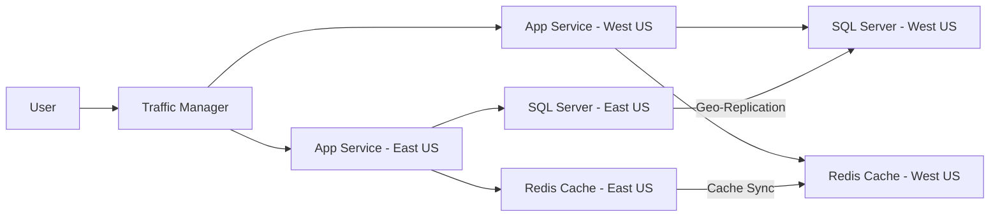

# Detailed Traffic Flow in Azure Active-Active Architecture

This document outlines the detailed traffic flow for an application deployed in an Azure active-active architecture across two regions: East US (Primary) and West US (Secondary).

## 1. Initial Request

-   Users initiate a request to access the application.

## 2. DNS Resolution

-   The user's DNS resolver queries the Azure Traffic Manager's DNS name (e.g., `app.trafficmanager.net`).

## 3. Traffic Manager Evaluation

-   Azure Traffic Manager uses the configured routing method (e.g., Performance, Priority, Geographic) to determine the appropriate endpoint.
    -   **Performance Routing:** Directs traffic to the region with the lowest latency from the user's location.
    -   **Priority Routing:** Sends all traffic to the primary region unless it's unhealthy, then fails over to the secondary.
    -   **Geographic Routing:** Routes traffic based on the geographic location of the user.

## 4. Endpoint Selection

-   Traffic Manager selects the appropriate endpoint (e.g., the App Service in East US or West US).

## 5. Request Routing

-   The user's request is routed to the selected App Service instance.

## 6. Application Processing

-   The App Service processes the request.
    -   If the request involves database operations, the App Service connects to the local SQL Server.
    -   Data is read from or written to the SQL Server.
    -   Geo-replication ensures data consistency between the primary and secondary databases.

## 7. Cache Handling

-   The App Service may interact with the Redis Cache for session state or frequently accessed data.
    -   Cache synchronization between regions ensures data availability and consistency.

## 8. Response

-   The App Service sends the response back to the user.

## 9. Monitoring and Failover

-   Azure Monitor continuously monitors the health of the application endpoints.
-   If the primary region becomes unhealthy:
    -   Traffic Manager detects the failure.
    -   Traffic Manager automatically redirects traffic to the secondary region.
    -   Users are seamlessly routed to the West US App Service.

## 10. Continuous Integration/Continuous Deployment (CI/CD)

-   Azure DevOps is used to manage the CI/CD pipeline.
-   Code changes are automatically deployed to both regions to ensure consistency.
-   Container Registry ensures that the same container images are used in both regions.

## Diagram

## Considerations

-   **Data Consistency:** Ensure geo-replication is properly configured for SQL Server.
-   **Cache Synchronization:** Implement cache synchronization between regions.
-   **Monitoring:** Set up comprehensive monitoring using Azure Monitor.
-   **CI/CD:** Automate deployments to both regions using Azure DevOps.
-   **Traffic Manager Configuration:** Choose the appropriate routing method based on application requirements.
